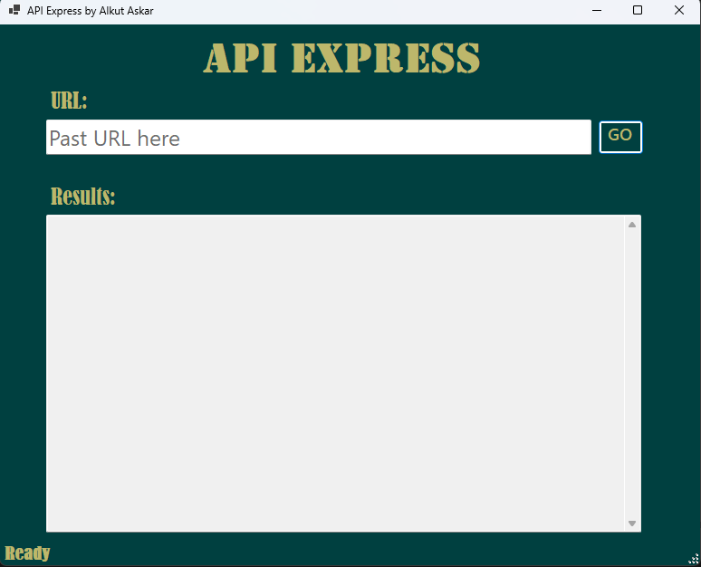
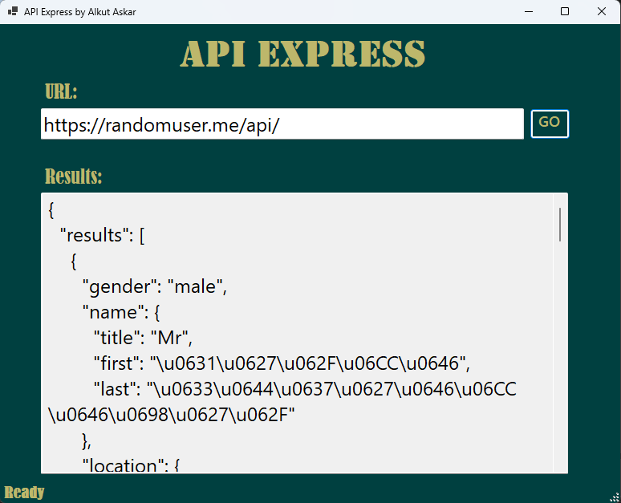

APIExpress
APIExpress is a powerful and easy-to-use API checker application designed to help developers test their APIs efficiently. With a sleek interface and robust features, APIExpress simplifies the process of sending requests and analyzing responses.

Features
User-Friendly Interface: An intuitive UI that makes it easy to send API requests.
Multiple Request Types: Supports GET, POST, PUT, DELETE, and other HTTP methods.
Custom Headers: Easily add and manage custom headers for your requests.
Request Body: Supports JSON format.

